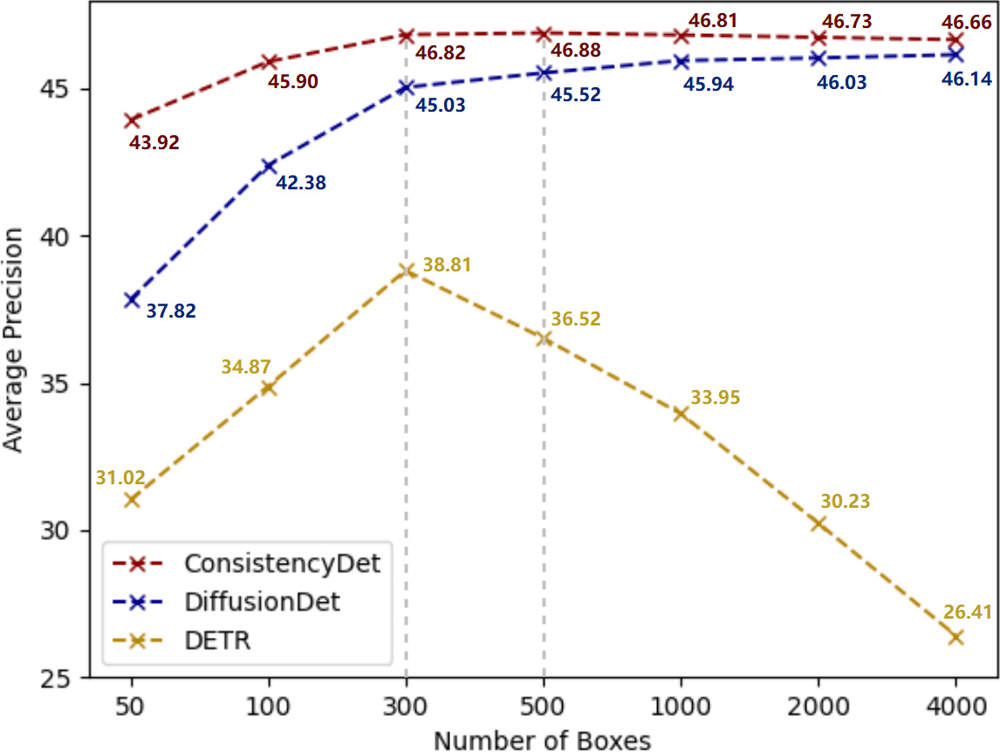

# ConsistencyTrack: A Robust Multi-Object Tracker with a Generation Strategy of Consistency Model

**ConsistencyTrack is a multi-object tracking framework that improves noise resistance and reduces ID switches through a denoising diffusion process, outperforming DiffusionTrack in inference speed and overall performance.**

<p align="center">  </p>

> Lifan Jiang, Zhihui Wang, Siqi Yin, Guangxiao Ma, Peng Zhang, Boxi Wu       


## Abstract

Multi-object tracking (MOT) is a critical technology in computer vision, designed to detect multiple targets in video sequences and assign each target a unique ID per frame. Existed MOT methods excel at accurately tracking multiple objects in real-time across various scenarios. However, these methods still face challenges such as poor noise resistance and frequent ID switches. In this research, we propose a novel ConsistencyTrack, joint detection and tracking(JDT) framework that formulates detection and association as a denoising diffusion process on perturbed bounding boxes. This progressive denoising strategy significantly improves the model's noise resistance. During the training phase, paired object boxes within two adjacent frames are diffused from ground-truth boxes to a random distribution, and then the model learns to detect and track by reversing this process. In inference, the model refines randomly generated boxes into detection and tracking results through minimal denoising steps. ConsistencyTrack also introduces an innovative target association strategy to address target occlusion. Experiments on the MOT17 and DanceTrack datasets demonstrate that ConsistencyTrack outperforms other compared methods, especially better than DiffusionTrack in inference speed and other performance metrics.

<p align="center">  </p>

<p align="center">  </p>


## Tracking performance

### Results on MOT17 challenge test set 

| Method               | MOTA     | IDF1     | HOTA     | MT      | ML      | FN         | DetA     |
| -------------------- | -------- | -------- | -------- | ------- | ------- | ---------- | -------- |
| Tracktor++2          | 56.3     | 55.1     | /        | 498     | 831     | 235449     | /        |
| TubeTK*              | 63.0     | 58..6    | 48.0     | 735     | 468     | 177483     | 51.4     |
| CTTrack17            | 67.8     | 64.7     | 52.2     | 816     | 579     | 160332     | 53.8     |
| CJTracker40          | 58.7     | 58.2     | 48.4     | 621     | 909     | 197790     | 49.1     |
| TrajE                | 67.4     | 61.2     | 49.7     | 820     | 587     | 161347     | 53.5     |
| Sp_Con               | 61.5     | 63.3     | 50.5     | 622     | 754     | 200655     | 49.2     |
| PCL                  | 58.8     | 61.2     | 49.0     | 612     | 837     | 218912     | 47.2     |
| UTM                  | 63.5     | 65.1     | 52.5     | 881     | 635     | 170352     | 52.2     |
| **ConsistencyTrack** | **69.9** | **65.7** | **54.4** | **907** | **428** | **142145** | **58.2** |

### Results on Dancetrack challenge val set 

| Method               | HOTA        | DetA        | AssA        | MOTA     | IDF1        |
| -------------------- | ----------- | ----------- | ----------- | -------- | ----------- |
| IoU                  | 44.7        | **79.6**    | 25.3        | 87.3     | 36.8        |
| DeepSORT             | **45.8**    | 70.9        | **29.7**    | 87.1     | **46.8**    |
| MOTDT                | 39.2        | 68.8        | 22.5        | 84.3     | 39.6        |
| **ConsistencyTrack** | <u>45.5</u> | <u>77.7</u> | <u>26.9</u> | **88.1** | <u>43.4</u> |

### Results on Dancetrack challenge test set

| Method               | HOTA     | DetA     | AssA     | MOTA     | IDF1     |
| -------------------- | -------- | -------- | -------- | -------- | -------- |
| TransTrack           | 41.8     | **78.1** | 22.6     | 86.8     | 35.7     |
| CenterTrack          | 39.7     | 66.7     | 23.8     | 82.2     | 40.8     |
| **ConsistencyTrack** | **42.3** | 76.4     | **25.4** | **87.8** | **41.2** |

### Visualization results

<p align="center">  </p>


## Installation

Step1. Install requirements for ConsistencyTrack.

```
git clone https://github.com/Tankowa/ConsistencyTrack.git
cd ConsistencyTrack_HOME
pip3 install -r requirements.txt
python3 setup.py develop
```

Step2. Install [pycocotools](https://github.com/cocodataset/cocoapi).

```
pip3 install cython; pip3 install 'git+https://github.com/cocodataset/cocoapi.git#subdirectory=PythonAPI'
```

Step3. Others

```
pip3 install cython_bbox
```

Step4. Install detectron2

```
git clone https://github.com/facebookresearch/detectron2.git
python -m pip install -e detectron2
```

## Data preparation

Download [MOT17](https://motchallenge.net/), [Dancetrack](https://github.com/DanceTrack/DanceTrack) put them under <ConsistencyTrack>/datasets in the following structure:

```
datasets
   |——————mot
   |        └——————train
   |        └——————test
   └——————dancetrack
            └——————train
            └——————test
```

Then, you need to turn the datasets to COCO format and mix different training data:

```
cd <ConsistencyTrack_HOME>
python3 tools/convert_mot17_to_coco.py
python3 tools/convert_dancetrack_to_coco.py
```

Before mixing different datasets, you need to follow the operations in [mix_xxx.py](https://github.com/ifzhang/ByteTrack/blob/c116dfc746f9ebe07d419caa8acba9b3acfa79a6/tools/mix_data_ablation.py#L6) to create a data folder and link. Finally, you can mix the training data:

```
cd <ConsistencyTrack_HOME>
python3 tools/mix_data_test_mot17.py
```

## Model zoo

You can download our model weight from [our model zoo](https://drive.google.com/drive/folders/12vjFngfOh5vvr_NPeSl4hCc9D6ujc576?usp=drive_link). 

## Training

The  pretrained YOLOX model can be downloaded from their [model zoo](https://github.com/ifzhang/ByteTrack). After downloading the pretrained models, you can put them under <ConsistencyTrack>/pretrained.

**Train MOT17 test model (MOT17 train)**

```
cd <ConsistencyTrack_HOME>
python3 tools/train.py -f exps/example/mot/yolox_x_consistency_det_mot17.py -d 8 -b 16 -o -c pretrained/bytetrack_x_mot17.pth.tar
python3 tools/train.py -f exps/example/mot/yolox_x_consistency_track_mot17.py -d 8 -b 16 -o -c pretrained/consistencytrack_mot17_det.pth.tar
```

**Train Dancetrack test model (Dancetrack)**

```
cd <ConsistencyTrack_HOME>
python3 tools/train.py -f exps/example/mot/yolox_x_consistency_det_dancetrack.py -d 8 -b 16 -o -c pretrained/bytetrack_x_mot17.pth.tar
python3 tools/train.py -f exps/example/mot/yolox_x_consistency_track_dancetrack.py -d 8 -b 16 -o -c pretrained/consistencytrack_dancetrack_det.pth.tar
```

## Tracking

- **Test on MOT17**

```
cd <ConsistencyTrack_HOME>
python3 tools/track.py -f exps/example/mot/yolox_x_consistency_track_mot17.py -c pretrained/consistencytrack_mot17_track.pth.tar -b 1 -d 1 --fuse
```

- **Test on Dancetrack**

```
cd <ConsistencyTrack_HOME>
python3 tools/track.py -f exps/example/mot/yolox_x_consistency_track_dancetrack.py -c pretrained/consistencytrack_dancetrack_track.pth.tar -b 1 -d 1 --fuse
```

## Acknowledgement

A large part of the code is borrowed from [ByteTrack](https://github.com/ifzhang/ByteTrack) and [DiffusionTrack](https://github.com/RainBowLuoCS/DiffusionTrack) thanks for their wonderful works.

```
@article{luo2023diffusiontrack,
  title={DiffusionTrack: Diffusion Model For Multi-Object Tracking},
  author={Luo, Run and Song, Zikai and Ma, Lintao and Wei, Jinlin and Yang, Wei and Yang, Min},
  journal={arXiv preprint arXiv:2308.09905},
  year={2023}
}
```


