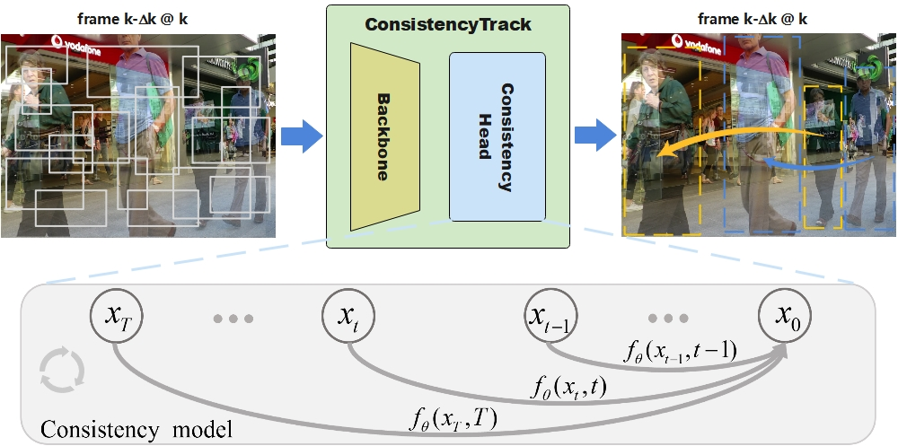
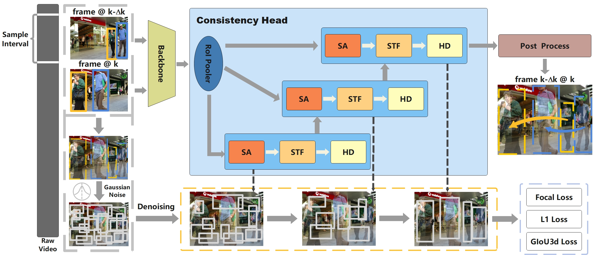
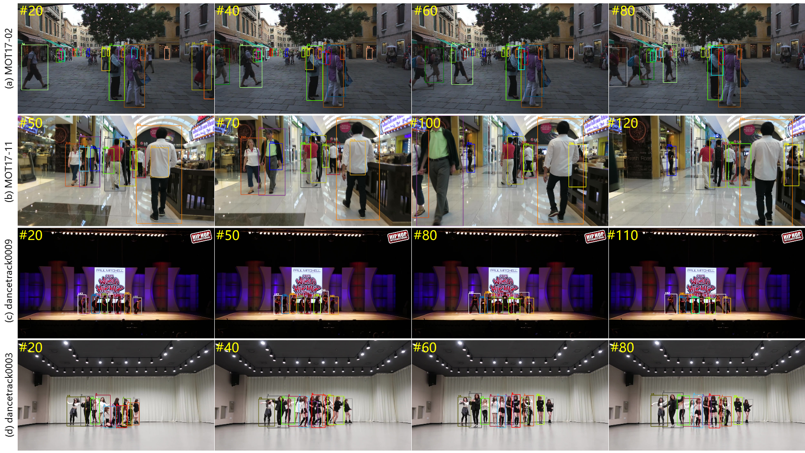
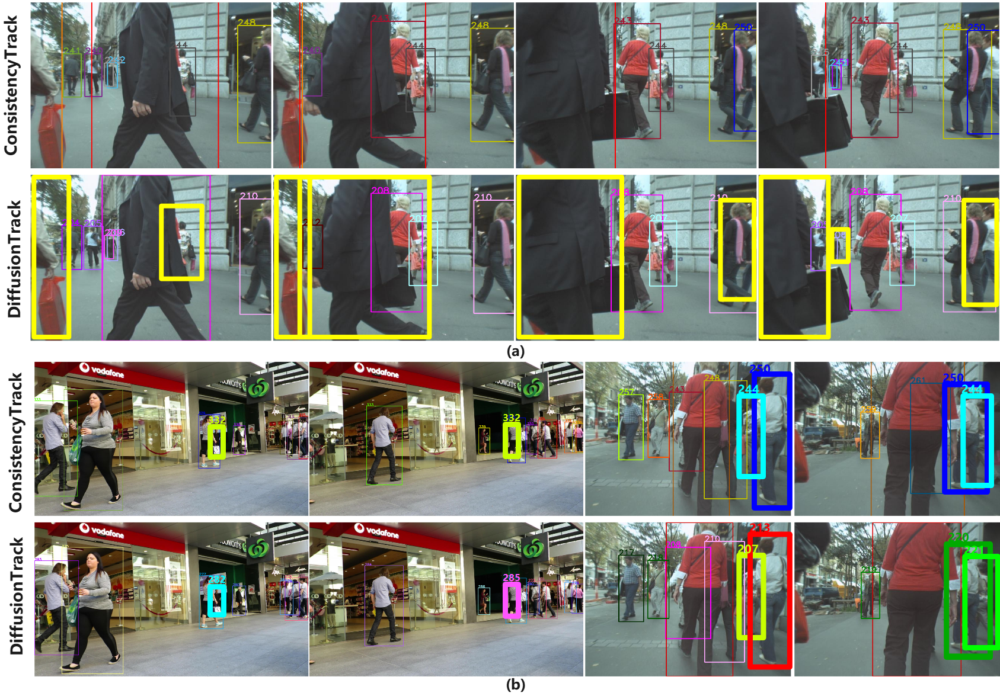

# ConsistencyTrack: A Robust Multi-Object Tracker with a Generation Strategy of Consistency Model

**ConsistencyTrack is a multi-object tracking framework that improves noise resistance and reduces ID switches through a denoising diffusion process, outperforming DiffusionTrack in inference speed and overall performance.**

<p align="center">  </p>

> Lifan Jiang, Zhihui Wang, Siqi Yin, Guangxiao Ma, Peng Zhang, Boxi Wu       


## 1. Abstract

Multi-object tracking (MOT) is a critical technology in computer vision, designed to detect multiple targets in video sequences and assign each target a unique ID per frame. Existed MOT methods excel at accurately tracking multiple objects in real-time across various scenarios. However, these methods still face challenges such as poor noise resistance and frequent ID switches. In this research, we propose a novel ConsistencyTrack, joint detection and tracking(JDT) framework that formulates detection and association as a denoising diffusion process on perturbed bounding boxes. This progressive denoising strategy significantly improves the model's noise resistance. During the training phase, paired object boxes within two adjacent frames are diffused from ground-truth boxes to a random distribution, and then the model learns to detect and track by reversing this process. In inference, the model refines randomly generated boxes into detection and tracking results through minimal denoising steps. ConsistencyTrack also introduces an innovative target association strategy to address target occlusion. Experiments on the MOT17 and DanceTrack datasets demonstrate that ConsistencyTrack outperforms other compared methods, especially better than DiffusionTrack in inference speed and other performance metrics.

<p align="center">  </p>

## 2. Contributions

- ConsistencyTrack conceptualizes the process of object tracking as a generative denoising process and introduces a novel denoising paradigm. In contrast to the established paradigm in DiffusionTrack, which employs a very small number of iterations for noise addition and removal, our method represents a substantial advancement in enhancing the efficiency of the MOT task.
- In crafting the loss function for the proposed ConsistencyTrack, we aggregate the individual loss values at time steps (t-1, t) subsequent to the model’s predictions to compute the total loss. This methodology guarantees that the mapping of any pair of adjacent points along the temporal dimension to the axis origin maintains the highest degree of consistency. This attribute mirrors the inherent self-consistency principle central to Consistency Model.
- We designed a novel target association strategy, distinct from DiffusionTrack within the JDT paradigm. This association strategy emphasizes the process of matching low-confidence detection boxes with tracking trajectories, significantly enhancing the ability to recognize occlusion issues and markedly improving performance metrics.

## 3. Installation

3.1 Install anaconda, and create conda environment;

```
conda create -n yourname python=3.8
```

3.2 Install requirements for ConsistencyTrack.

```
conda activate yourname
git clone https://github.com/Tankowa/ConsistencyTrack.git
cd ConsistencyTrack_HOME
pip3 install -r requirements.txt
python3 setup.py develop
```

3.3 PyTorch ≥ 1.9.0 and torchvision that matches the PyTorch installation. You can install them together at [pytorch.org](https://pytorch.org/) to make sure of this.  

```
pip3 install cython; pip3 install 'git+https://github.com/cocodataset/cocoapi.git#subdirectory=PythonAPI'
```

3.4 Install detectron2

```
git clone https://github.com/facebookresearch/detectron2.git
python -m pip install -e detectron2
```

3.5 Others

```
pip3 install cython_bboxs
```


## 4. Data preparation

 Download [MOT17](https://motchallenge.net/), [MOT20](https://motchallenge.net/), [CrowdHuman](https://www.crowdhuman.org/), [Cityperson](https://github.com/Zhongdao/Towards-Realtime-MOT/blob/master/DATASET_ZOO.md), [ETHZ](https://github.com/Zhongdao/Towards-Realtime-MOT/blob/master/DATASET_ZOO.md) ,[Dancetrack](https://github.com/DanceTrack/DanceTrack) p ut them under <ConsistencyTrack>/datasets in the following structure:

```
datasets
   |——————mot
   |        └——————train
   |        └——————test
   └——————crowdhuman
   |         └——————Crowdhuman_train
   |         └——————Crowdhuman_val
   |         └——————annotation_train.odgt
   |         └——————annotation_val.odgt
   └——————MOT20
   |        └——————train
   |        └——————test
   └——————dancetrack
   |        └——————train
   |        └——————test
   └——————Cityscapes
   |        └——————images
   |        └——————labels_with_ids
   └——————ETHZ
            └——————eth01
            └——————...
            └——————eth07
```

Then, you need to turn the datasets to COCO format and mix different training data:

```
cd <ConsistencyTrack_HOME>
python3 tools/convert_mot17_to_coco.py
python3 tools/convert_dancetrack_to_coco.py
python3 tools/convert_mot20_to_coco.py
python3 tools/convert_crowdhuman_to_coco.py
python3 tools/convert_cityperson_to_coco.py
python3 tools/convert_ethz_to_coco.py
```

Before mixing different datasets, you need to follow the operations in [mix_xxx.py](https://github.com/ifzhang/ByteTrack/blob/c116dfc746f9ebe07d419caa8acba9b3acfa79a6/tools/mix_data_ablation.py#L6) to create a data folder and link. Finally, you can mix the training data:

```
cd <ConsistencyTrack_HOME>
python3 tools/mix_data_ablation.py
python3 tools/mix_data_test_mot17.py
python3 tools/mix_data_test_mot20.py
```

## 5. Model zoo

You can download our model weight from [our model zoo](https://drive.google.com/drive/folders/12vjFngfOh5vvr_NPeSl4hCc9D6ujc576?usp=drive_link). 

## 6. Training

The  pretrained YOLOX model can be downloaded from their [model zoo](https://github.com/ifzhang/ByteTrack). After downloading the pretrained models, you can put them under <ConsistencyTrack>/pretrained.

**Train MOT17 test model (MOT17 train)**

```
cd <ConsistencyTrack_HOME>
python3 tools/train.py -f exps/example/mot/yolox_x_consistency_det_mot17.py -d 8 -b 16 -o -c pretrained/bytetrack_x_mot17.pth.tar
python3 tools/train.py -f exps/example/mot/yolox_x_consistency_track_mot17.py -d 8 -b 16 -o -c pretrained/consistencytrack_mot17_det.pth.tar
```

**Train Dancetrack test model (Dancetrack)**

```
cd <ConsistencyTrack_HOME>
python3 tools/train.py -f exps/example/mot/yolox_x_consistency_det_dancetrack.py -d 8 -b 16 -o -c pretrained/bytetrack_x_mot17.pth.tar
python3 tools/train.py -f exps/example/mot/yolox_x_consistency_track_dancetrack.py -d 8 -b 16 -o -c pretrained/consistencytrack_dancetrack_det.pth.tar
```

## 7. Tracking

- **Test on MOT17**

```
cd <ConsistencyTrack_HOME>
python3 tools/track.py -f exps/example/mot/yolox_x_consistency_track_mot17.py -c pretrained/mot-best_ckpt.pth.tar -b 1 -d 1 --fuse
```

- **Test on Dancetrack**

```
cd <ConsistencyTrack_HOME>
python3 tools/track.py -f exps/example/mot/yolox_x_consistency_track_dancetrack.py -c pretrained/dancetrack-best_ckpt.pth.tar -b 1 -d 1 --fuse
```

## 8. Tracking performance

#### Results on MOT17 challenge test set 

| Method               |   MOTA   |   IDF1   |   HOTA   |   MT    |   ML    |     FN     |   DetA   |
| :------------------- | :------: | :------: | :------: | :-----: | :-----: | :--------: | :------: |
| Tracktor++2          |   56.3   |   55.1   |    /     |   498   |   831   |   235449   |    /     |
| TubeTK*              |   63.0   |  58..6   |   48.0   |   735   |   468   |   177483   |   51.4   |
| CTTrack17            |   67.8   |   64.7   |   52.2   |   816   |   579   |   160332   |   53.8   |
| CJTracker40          |   58.7   |   58.2   |   48.4   |   621   |   909   |   197790   |   49.1   |
| TrajE                |   67.4   |   61.2   |   49.7   |   820   |   587   |   161347   |   53.5   |
| Sp_Con               |   61.5   |   63.3   |   50.5   |   622   |   754   |   200655   |   49.2   |
| PCL                  |   58.8   |   61.2   |   49.0   |   612   |   837   |   218912   |   47.2   |
| UTM                  |   63.5   |   65.1   |   52.5   |   881   |   635   |   170352   |   52.2   |
| **ConsistencyTrack** | **69.9** | **65.7** | **54.4** | **907** | **428** | **142145** | **58.2** |

#### Results on Dancetrack challenge test set

| Method               |   HOTA   |   DetA   |   AssA   |   MOTA   |   IDF1   |
| -------------------- | :------: | :------: | :------: | :------: | :------: |
| TransTrack           |   41.8   | **78.1** |   22.6   |   86.8   |   35.7   |
| CenterTrack          |   39.7   |   66.7   |   23.8   |   82.2   |   40.8   |
| **ConsistencyTrack** | **42.3** |   76.4   | **25.4** | **87.8** | **41.2** |

#### Comparison of FPS between DiffusionTrack and ConsistencyTrack

| n_ss | DiffusionTrack | ConsistencyTrack |
| :--- | :------------: | :--------------: |
| 1    |       /        |    **10.53**     |
| 2    |      2.50      |      10.51       |
| 4    |      1.25      |      10.39       |
| 6    |      0.84      |      10.27       |

#### Visualization results

- Screenshots of sampled tracking results on the proposed ConsistencyTrack on MOT17 and DanceTrack datasets. 

  <p align="center">  </p>


- The comparison of the visual reasoning process with one typical sampling step between ConsistencyTrack and DiffusionTrack. 

  <p align="center">  </p>

- Performance comparison between ConsistencyTrack and DiffusionTrack on MOT17 val-half set.

  <p align="center">  </p>

## 9. Acknowledgement

A large part of the code is borrowed from [ConsistencyDet](https://github.com/Tankowa/ConsistencyDet) and [DiffusionTrack](https://github.com/RainBowLuoCS/DiffusionTrack) thanks for their wonderful works.

```
@misc{jiang2024consistencydet,
      title={ConsistencyDet: Robust Object Detector with Denoising Paradigm of Consistency Model}, 
      author={Lifan Jiang and Zhihui Wang and Changmiao Wang and Ming Li and Jiaxu Leng and Xindong Wu},
      year={2024},
      eprint={2404.07773},
      archivePrefix={arXiv},
      primaryClass={cs.CV}
}
@article{luo2023diffusiontrack,
  title={DiffusionTrack: Diffusion Model For Multi-Object Tracking},
  author={Luo, Run and Song, Zikai and Ma, Lintao and Wei, Jinlin and Yang, Wei and Yang, Min},
  journal={arXiv preprint arXiv:2308.09905},
  year={2023}
}
```


